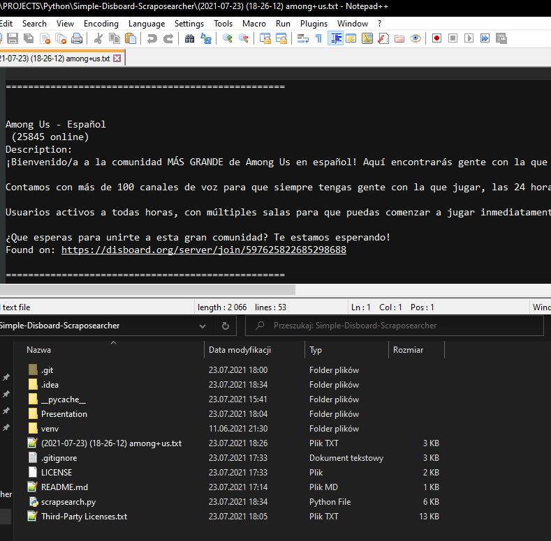

# Simple-Disboard-Scraposearcher
Web scraper for https://disboard.org, which allows you to search for multiple tags and multiple language flags. Written in Python 3.9.

# Step-by-step:
0. Launch scrapsearch.py, there are a lot of ways to launch a python file. My method is just moving to the source folder of the file and typing "python <file_name>.py" (additionally you can launch this program with command line parameters).
1. Firstly, as a search query, write type (server's main topic) of server you want to find (for example, if you want to play Among Us then type "Among Us", if you want to find servers with programming as a main topic then type "programming").
2. Then, you will know how many pages are there to scrap from. Every page contains 24 servers. Type number or leave it empty if you want to search for every single page.
3. After that, you can enter tags you want to search. Tags are like these: . They are like server's secondary topic/s. But, if you want to search for servers with only specific flag without adding tags leave the field empty.
4. Next, the flag/s. It is the language that server uses (at least theoretically). Here is their appearance on the site: . Write two letter acronym of your country to use it (for ex. if you are from Russia, use ru, if you are from Spain, use es, etc). But, you don't have to write anything (if you wrote something in the tags field, otherwise the program won't work).
5. Lastly, the rule. There are two options: "AND" and "OR". If you want to find a server that contains one of the tags AND the flag/s then use "AND". Option "OR" is for situation where you want to find a server with one of the tags OR specific flag (which equals more servers to find). By the way, if one of the fields (flags or tags) is empty then you have to use OR option.
6. And that's it. The search begins... and have fun looking for the best Discord server. If you want to cancel/interrupt the search then use CTRL+C. The program also saves your search results in the text file, next to the launched python file: .

# Uses:
- [BeautifulSoup](https://pypi.org/project/beautifulsoup4),
- [requests](https://pypi.org/project/requests).
